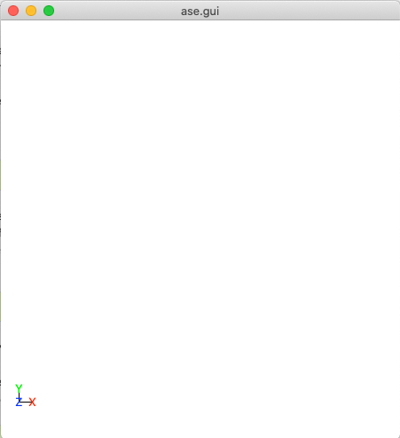

.. _External_programs_that_will_be_useful_to_install_for_using_Adsorber:

External Programs that will be useful to install for using ``Adsorber``
#######################################################################

There will be two programs that we will use to view clusters/surface models that we will use and create in ``Adsorber``.

ASE GUI (from Atomic Simulation Environment)
********************************************

The ASE GUI is a program that is use to view clusters in ASE. It is build very simply and is perfect for looking at all of the models we will be making and using for ``Adsorber``.

The ASE GUI runs through ASE. To install ASE, see :ref:`Install_ASE`. Once install, you can type the following into the terminal to show the ASE GUI:

.. code-block:: bash

	ase gui

This should show a gui with nothing in it, as shown below.

   This is a blank ase gui screen that you would see if enter ``ase gui`` into the terminal.

You can then look at your surface model by entering in the following into the terminal, where ``name_of_your_file`` is the name of the file of your cluster/surface model that you wish to look at in ASE GUI.

.. code-block:: bash

	ase gui name_of_your_file

You will then see your model in ASE GUI. An example of this is shown below:

   This is the ase gui screen that shows an example of a cluster on it.

Jmol
****

Jmol is another program that is used to visualise chemical systems. See `Jmol Web Page <http://jmol.sourceforge.net/>`_ for information about how to download Jmol on your computer. Once you have downloaded Jmol, add this to your ``~/.bashrc`` for each access to Jmol in your terminal

.. code-block:: bash

	function jmol(){ /Path_to_Jmol/jmol-VERSION_NO/jmol.sh $* >/dev/null & }

where ``Path_to_Jmol`` is the path to your Jmol folder that you have just downloaded and untarred/unzipped and ``jmol-VERSION_NO`` is the folder that Jmol is in (that you have just downloaded and untarred/unzipped). 

To test that Jmol is working, type into the terminal:

.. code-block:: bash

	jmol

This should show a gui with nothing in it, as shown below.

   This is a blank Jmol gui screen that you would see if enter ``Jmol`` into the terminal.

You can then look at your surface model by entering in the following into the terminal, where ``name_of_your_file`` is the name of the file of your cluster/surface model that you wish to look at in Jmol.

.. code-block:: bash

	jmol name_of_your_file

You will then see your model in Jmol GUI. An example of this is shown below:

.. figure:: Images/Cu_Cluster_Example_Jmol.png
   :align: center
   :figwidth: 50%
   :alt: Cu_Cluster_Example_Jmol

   This is the Jmol screen that shows an example of a cluster on it.