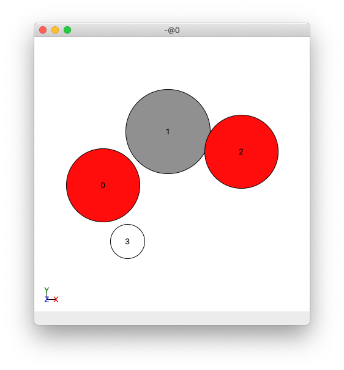

.. _How_To_Obtain_Settings_for_Run_Adsorber:

How to obtain some of the settings for the ``Run_Adsorber.py`` script
#####################################################################

Following the :ref:`How_To_Run_Adsorber` page that indicated what settings and inputs are needed to run the ``Run_Adsorber.py`` script, on this webpage we will describe how to obtain some of the settings that are not obvious as to how to obtain them from the :ref:`How_To_Run_Adsorber` page. This includes how to obtain the information required to tell Adsorber how to bind atoms and molecules to the surface of your system. 

This page requires the use of ASE GUI to view our chemical systems. The installation and use of this visualisation programs is given in :ref:`External_programs_that_will_be_useful_to_install_for_using_Adsorber`. 

.. _marking_surface_atoms:

How to Mark Surface Atoms in your Cluster/Surface model in Adsorber 
*******************************************************************

One of the pieces of information that ``Adsorber`` need to know are which atoms on your cluster are the surface atoms. The easiest way to figure out which atoms are surface atoms is to open your cluster/surface model in ``ASE GUI``. An example is given below:

.. figure:: Images/Cu_Cluster_Example_ASE_Surface_1.png
   :align: center
   :figwidth: 50%
   :alt: Cu_Cluster_Example_ASE_Surface_1

   An example cluster when observed in ASE GUI.

Then you want to go to show the indices of the atoms in your cluster/surface model by clicking in the menu ``View > Show Labels > Atom Index``. This will show the indices of atoms in your cluster/surface model in your ASE GUI. 

.. figure:: Images/Cu_Cluster_Example_ASE_Surface_2.png
   :align: center
   :figwidth: 50%
   :alt: Cu_Cluster_Example_ASE_Surface_2

   An example cluster when observed in ASE GUI, where atoms have been labelled by their indices.

We will want to include the indices of the surface atoms in your cluster/surface model in the ``Run_Adsorber.py`` file in the ``surface_atoms`` list. In the example given in the ``Examples/Cu78_Example/15-3-3629.xyz`` file, the surface atoms are:

.. code-block:: python

	surface_atoms = [11,25,28,13,3,8,6,23,22,59,34,62,66,1,0,4,30,15,14,16,5,12,29,2,7,10,24,26,70,35,47,50,60,63,48,39,41,44,54,68,76,71,32,31,74,42,56,52,43,40,46,61,53,45,57,72,73,77]

The ``Adsorber`` program will create a ``.xyz`` file called ``SYSTEM_NAME_tagged_surface_atoms.xyz`` that will have all surface atoms tagged 1 and all non-surface atoms tagged 0 (where ``SYSTEM_NAME`` is the name of the ``.xyz`` or ``.traj`` file that you gave for the ``name`` variable in ``Run_Adsorber.py``, see :ref:`How_To_Run_Adsorber`). You can see this if you open ``SYSTEM_NAME_tagged_surface_atoms.xyz`` in ASE GUI, show atom index label by clicking ``View > Show Labels > Atom Index``, and colouring in atoms based on their tag by clicking ``View > Colors`` and selecting ``By tag``:

.. figure:: Images/Cu_Cluster_Example_ASE_Surface_3_1.png
   :align: center
   :figwidth: 50%
   :alt: Cu_Cluster_Example_ASE_Surface_3_1

   Front view of an image of the example cluster where surface atoms are coloured pick, and non-surface atoms coloured green. This example ``.xyz`` file is created by ``Adsorber``. 

.. figure:: Images/Cu_Cluster_Example_ASE_Surface_3_2.png
   :align: center
   :figwidth: 60%
   :alt: Cu_Cluster_Example_ASE_Surface_3_2

   Side view of an image of the example cluster where surface atoms are coloured pick, and non-surface atoms coloured green. This example ``.xyz`` file is created by ``Adsorber``. 

All the surface atoms should be coloured pink, while the non-surface atoms coloured green. If there are any bulk atom coloured pink or surface atoms coloured green, you will need to remove or add the indices of atoms from the ``surface_atoms`` list in the ``Run_Adsorber.py`` file to make sure that ``surface_atoms`` reflects the atoms in the cluster/surface model that are in fact surface atoms.

Note that if there are surface atoms that you do not want molecules to adsorb to, dont include them in this list. 

How to Bind Molecule to the Surface of your Cluster/Surface Model in Adsorber
*****************************************************************************

There are many ways that a molecule can be bound to the surface of a cluster/surface model. There are two or three components that are important for adsorbing a molecule to a surface. These are the atom in the molecule that is bound to the surface *via* (**index**), the alignment of the molecule to the surface (**axis**), and the orientation of the molecule to the surface (**rotations**). These are given by the following three entries in the ``adsorbed_species`` dictionary for each molecule. 

* **index** (*int.*): This is the index of the atom in the molecule to adsorb to the surface for the cluster/surface model. 
* **axis** (*str./list/tuple*): This is the axis in your molecule that you would like to point away from the surface of the cluster/surface model, as well as to rotate your moleule around (if you would like to rotate your molecule around the axis). 
* **rotations** (*list/tuple*, optional): These are the angles of rotation that you would like to rotate the molecules around the **axis** on the surface of your cluster/surface model. If you have a linear molecule that is alligned to the **axis** or you do not want to rotate your molecule around the **axis**, you do not need to add this as this is an optional input. 

We will now describe the way to determine the **index**, **axis**, and **rotations** variables.

Specifying the **index** variable
=================================

First, open up the molecule that you want to adsorb to the surface in ASE. You can do this using the ASE GUI. If you are making your molecules in your ``Run_Adsorber.py`` you can take a look at it using the ``view`` method in the ``ase.visualize`` module:

.. code-block:: python
	
	from ase.visualize import view
	from ase.build import molecule

	COOH = molecule('HCOOH') # note the carbon is index 1
	del COOH[4] # remove the hydrogen atom

	view(COOH)

This will open a ASE GUI of the COOH molecule. If you click in the main menu ``View > Show Labels > Atom Index``, you will get the following view:

   View of a COOH molecule in ASE GUI, where the atoms have been labelled by their index. 

We would like to adsorb the C atom in the COOH molecule to the surface of our cluster/surface model. In this case, we would like to set **index** for this molecule to ``1`` to specify index 1.

Specifying the **axis** variable
================================

Next, we would like to specify the direction of the axis we would like to align our molecule to the surface of your cluster/surface model. 

This will align this axis to the "normal" of the surface. For above atom and bridge site, this axis will point as far away from any other atom on the cluster/surface model as possible. For this reason, we will point this vector from the **index** atom, which in this example is the index 1 C atom in this COOH molecule. 

For this example, we would like to align the molecule on the surface such that the oxygen atoms are on opposite sides of the **axis** vector as possible. THis can be achieved with a vector that points ``(0.1,-1,0)`` from looking at the above figure of the COOH atom. The ``Adsorber`` program will use the `Rodrigues formula <https://en.wikipedia.org/wiki/Rodrigues%27_formula>`_ to rotate the molecule by this axis onto the "normal" vector of the surface. 

Note that you can also specify the following string for the **axis** vector:

* ``'x'``:  This is the ``(1,0,0)`` vector
* ``'y'``:  This is the ``(0,1,0)`` vector
* ``'z'``:  This is the ``(0,0,1)`` vector
* ``'-x'``: This is the ``(-1,0,0)`` vector
* ``'-y'``: This is the ``(0,-1,0)`` vector
* ``'-z'``: This is the ``(0,0,-1)`` vector

Specifying the **rotations** variable
=====================================

Often you will want to sample a specific orientation for the molecule to adsorb to the surface of the cluster/surface model. ``Adsorber`` allows you to rotate the ad-molecule about the **axis** vector on the surface of your cluster/surface model to try to get the orientation(s) that you like. 

It is recommended to try a wide range of rotations and delete those rotations that do not work for you. To do this, set rotation to a range of angles, such as ``range(0,360,10)``, where the angles are given in degrees. This will create 36 ``.xyz`` files of the same molecule adsorbed to the same site on the cluster/surface feature, where each image is a different rotated orientation of the molecule on the surface of your cluster/surface feature. 

See the following youtube clip for an example of all the orientations that are created by the ``Adsorber`` program. 

.. raw:: html

    

      <iframe id="ytplayer" type="text/html" src="https://www.youtube.com/embed/fRnPBR23-_c?autoplay=1&loop=1&showinfo=0" frameborder="0" allowfullscreen style="position: absolute; top: 0; left: 0; width: 100%; height: 100%;"></iframe>
    

Above is a video of the various orientations of a COOH molecule adsorbed to a vertex site on a Cu78 nanocluster made by ``Adsorber``. 

How to enter **index**, **axis**, and **rotations** into the ``adsorbed_species`` dictionary in the ``Run_Adsorber.py`` script
==============================================================================================================================

Once you have specied the **index**, **axis**, and **rotations**, you can add them to the ``adsorbed_species`` dictionary in the ``Run_Adsorber.py`` script. An example for a COOH molecule is shown below:

.. code-block:: python

	COOH = molecule('HCOOH') # note the carbon is index 1
	del COOH[4] # remove the hydrogen atom
	COOH_axis = (0.1,-1,0)
	distance_of_adatom_from_surface = 1.25
	rotations = range(0,360,10)
	COOH_adsorbed_species = {'name': 'COOH', 'molecule': COOH, 'distance_of_adatom_from_surface': distance_of_adatom_from_surface, 'index': 1, 'axis': COOH_axis, 'rotations': rotations}

This dictionary is then appended to the ``adsorbed_species`` list in the ``Run_Adsorber.py`` script. See :ref:`Add the Atoms and Molecules on to the surface of your Cluster/Surface Model <add_atoms_and_molecules_on_to_surface_of_model>`.
