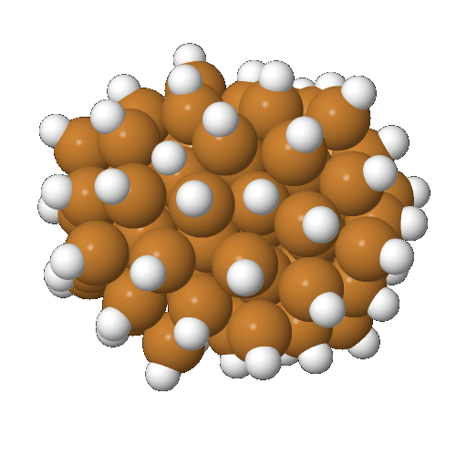

.. _Outputs_from_Adsorber:

What are the Outputs that you will get with Adsorber
####################################################

Next, we will look at all the output files that will be obtained from running Adsorber once. ``Adsorber`` will make a number of output files after you have run it. 

This page requires the use of ASE GUI and Jmol to view our chemical systems. The installation and use of these visualisation programs is given in :ref:`External_programs_that_will_be_useful_to_install_for_using_Adsorber`. 

First, as previously shown in :ref:`marking_surface_atoms`, the ``Adsorber`` program will create a ``.xyz`` file called ``SYSTEM_NAME_tagged_surface_atoms.xyz`` that will have all surface atoms tagged 1 and all non-surface atoms tagged 0 (where ``SYSTEM_NAME`` is the name of the ``.xyz`` or ``.traj`` file that you gave for the ``name`` variable in ``Run_Adsorber.py``, see :ref:`How_To_Run_Adsorber`). You can see this if you open ``SYSTEM_NAME_tagged_surface_atoms.xyz`` in ASE GUI, show atom index label by clicking ``View > Show Labels > Atom Index``, and colouring in atoms based on their tag by clicking ``View > Colors`` and selecting ``By tag``:

   Front view of an image of the example cluster where surface atoms are coloured pick, and non-surface atoms coloured green. This example ``.xyz`` file is created by ``Adsorber``. 

   Side view of an image of the example cluster where surface atoms are coloured pick, and non-surface atoms coloured green. This example ``.xyz`` file is created by ``Adsorber``. 

All the surface atoms should be coloured pink, while the non-surface atoms coloured green. If there are any bulk atom coloured pink or surface atoms coloured green, you will need to remove or add the indices of atoms from the ``surface_atoms`` list in the ``Run_Adsorber.py`` file to make sure that ``surface_atoms`` reflects the atoms in the cluster/surface model that are in fact surface atoms.

Second, ``Adsorber`` will create four xyz files that show all the binding sites that were found in your cluster/surface model. There are four types of binding sites that ``Adsorber`` looks for. These are:

1. Sites above individual surface atoms
2. Sites above bridging sites (in between two neighbouring atoms)
3. Sites above three-fold sites (in between three neighbouring atoms)
4. Sites above four-fold sites (in between four neighbouring atoms)

All of these types of binding sites are given in:

1. ``SYSTEM_NAME_above_atom_binding_sites.xyz``: Sites above individual surface atoms
2. ``SYSTEM_NAME_above_bridge_binding_sites.xyz``: Sites above bridging sites
3. ``SYSTEM_NAME_above_three_fold_sites.xyz``: Sites above three-fold sites
4. ``SYSTEM_NAME_above_four_fold_sites.xyz``: Sites above four-fold sites

Examples of ``SYSTEM_NAME_above_atom_binding_sites.xyz``, ``SYSTEM_NAME_above_bridge_binding_sites.xyz``, and ``SYSTEM_NAME_above_three_fold_sites.xyz`` are given below. This particular example does not contain any four-fold sites. 

   Sites above individual surface atoms.

   Sites above bridging sites (in between two neighbouring atoms).

   Sites above three-fold sites (in between three neighbouring atoms).

Here, the hydrogen atoms are used to indicate where all the binding sites are found for each type of binding site on your cluster/surface model. Molecule are placed on each of these sites by ``Adsorber``. The sites are labelled with a number in the same way that hydrogen are numerically labelled in your ``.xyz`` files. We want to use ``Jmol`` to see the hydrogen numerical label. To do this, first write either of the three lines into the terminal:

.. code-block:: bash

  jmol SYSTEM_NAME_above_atom_binding_sites.xyz
  jmol SYSTEM_NAME_above_bridge_binding_sites.xyz
  jmol SYSTEM_NAME_above_three_fold_sites.xyz
  jmol SYSTEM_NAME_above_four_fold_sites.xyz

This will open up your cluster/surface model in Jmol. Then in the Jmol menu click ``Display > Label > Name``. This will label all the atoms by their element symbol and number, where the binding site are labelled ``HX``, where ``X`` is the number of the hydrogen/binding site in the cluster/surface model. 

   Sites above individual surface atoms, where above atom binding site are labelled ``HX``, where ``X`` is the number for that binding site. 

   Sites above bridging sites (in between two neighbouring atoms), where bridging binding site are labelled ``HX``, where ``X`` is the number for that binding site. 

.. figure:: Images/Outputs/above_three_fold_sites_15-3-3629_labelled.png
   :align: center
   :figwidth: 50%
   :alt: above_three_fold_sites_labelled

   Sites above three-fold sites (in between three neighbouring atoms), where three-fold binding site are labelled ``HX``, where ``X`` is the number for that binding site. 

The last thing that is created by the ``Adsorber`` program is a folder called ``System_with_Adsorbed_Species``. This folder may contain the folders ``Above_Atom_Sites``, ``Above_Bridge_Sites``, ``Above_Three_Fold_Sites``, and ``Above_Four_Fold_Sites``. In these folders will contain a number of folders for all of the atoms and molecules that you want to adsorb to your cluster/surface model. Within these folders will contain all the ``.xyz`` files of all the atoms and molecules that you want to adsorb to your cluster/surface model, eith all the different rotations (orientations) for those molecules you want to try different orientations of. 

An example of the folders that are created by ``Adsorber`` is shown below:

   The folders that are created in for this example cluster. 

If you want to see the COOH molecule bound to three-fold site 44, you would go to ``System_with_Adsorbed_Species > Above_Three_Fold_Sites > COOH`` and look at any of the file with ``site_44`` in its name. This example is shown below, next to the original three-fold binding site ``.xyz`` file. 

.. figure:: Images/Outputs/COOH_site_44_rotation_0.png
   :align: center
   :figwidth: 60%
   :alt: above_three_fold_sites_labelled

   This example cluster with a COOH molecule adsorbed to three-fold site 44 (just one of the orientations is shown in this example).

.. figure:: Images/Outputs/above_three_fold_sites_15-3-3629_labelled.png
   :align: center
   :figwidth: 50%
   :alt: above_three_fold_sites_labelled

   Sites above three-fold sites (in between three neighbouring atoms), where three-fold binding site are labelled ``HX``, where ``X`` is the number for that binding site. 

