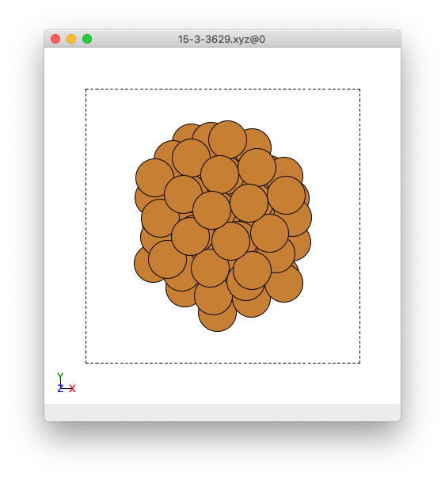
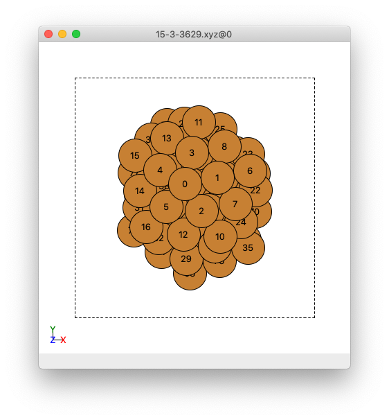

.. _Part_B1_marking_surface_atoms:

Part B1: How to Mark Surface Atoms in your Cluster/Surface model in Adsorber 
###################################################################################

One of the pieces of information that ``Adsorber`` need to know are which atoms on your cluster are the surface atoms. The easiest way to figure out which atoms are surface atoms is to open your cluster/surface model in ``ASE GUI``. An example is given below:

   An example cluster when observed in ASE GUI.

Then you want to go to show the indices of the atoms in your cluster/surface model by clicking in the menu ``View > Show Labels > Atom Index``. This will show the indices of atoms in your cluster/surface model in your ASE GUI. 

   An example cluster when observed in ASE GUI, where atoms have been labelled by their indices.

We will want to include the indices of the surface atoms in your cluster/surface model in the ``adsorbate.py`` file in the ``surface_atoms`` list. In the example given in the ``Examples/Cu78_Example/15-3-3629.xyz`` file, the surface atoms are:

.. code-block:: python

   surface_atoms = [11,25,28,13,3,8,6,23,22,59,34,62,66,1,0,4,30,15,14,16,5,12,29,2,7,10,24,26,70,35,47,50,60,63,48,39,41,44,54,68,76,71,32,31,74,42,56,52,43,40,46,61,53,45,57,72,73,77]

The ``Adsorber`` program will create a ``.xyz`` file called ``SYSTEM_NAME_tagged_surface_atoms.xyz`` that will have all surface atoms tagged 1 and all non-surface atoms tagged 0 (where ``SYSTEM_NAME`` is the name of the ``.xyz`` or ``.traj`` file that you gave for the ``name`` variable in ``general.py``, see :ref:`Prelude_General_and_Adsorbates_scripts`). You can see this if you open ``SYSTEM_NAME_tagged_surface_atoms.xyz`` in ASE GUI, show atom index label by clicking ``View > Show Labels > Atom Index``, and colouring in atoms based on their tag by clicking ``View > Colors`` and selecting ``By tag``:

.. figure:: Images/Cu_Cluster_Example_ASE_Surface_3_1.png
   :align: center
   :figwidth: 50%
   :alt: Cu_Cluster_Example_ASE_Surface_3_1

   Front view of an image of the example cluster where surface atoms are coloured pick, and non-surface atoms coloured green. This example ``.xyz`` file is created by ``Adsorber``. 

.. figure:: Images/Cu_Cluster_Example_ASE_Surface_3_2.png
   :align: center
   :figwidth: 60%
   :alt: Cu_Cluster_Example_ASE_Surface_3_2

   Side view of an image of the example cluster where surface atoms are coloured pick, and non-surface atoms coloured green. This example ``.xyz`` file is created by ``Adsorber``. 

All the surface atoms should be coloured pink, while the non-surface atoms coloured green. If there are any bulk atom coloured pink or surface atoms coloured green, you will need to remove or add the indices of atoms from the ``surface_atoms`` list in the ``adsorbate.py`` file to make sure that ``surface_atoms`` reflects the atoms in the cluster/surface model that are in fact surface atoms.
