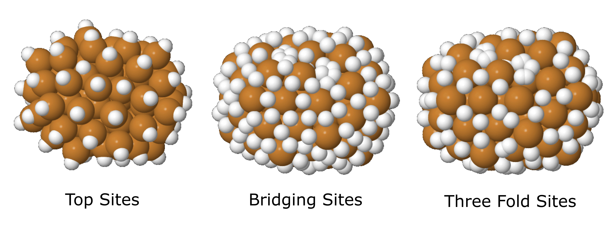
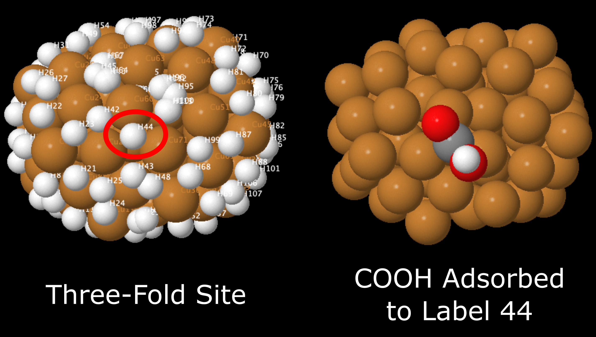
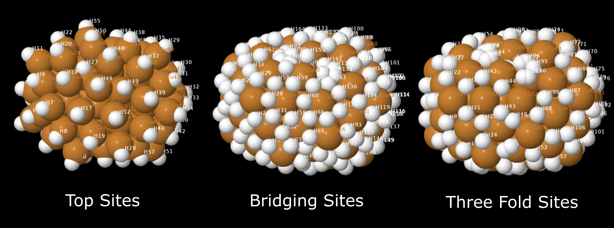
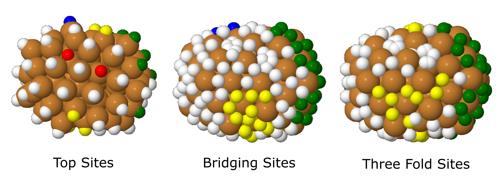
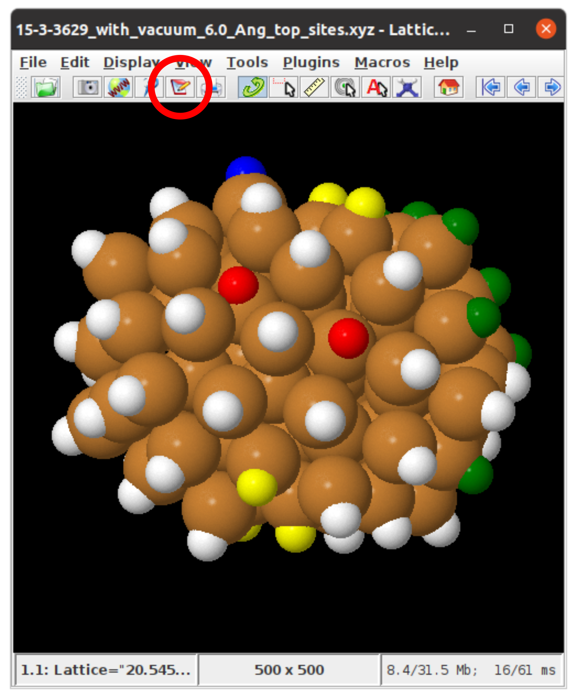

.. _Part_B_Adsorb_Adsorbates_to_System:

Part B: Adsorbing Adsorbates to your System
###########################################

Once you have locally optimsed your system, you can adsorb your adsorbates to your system. To do this, **set the** ``Step_to_Perform`` **variable in the** ``Run_Adsorber.py`` **script to** ``'Part B'``:

.. code-block:: python

   Step_to_Perform = 'Part B'

You can then run the ``Run_Adsorber.py`` script in the terminal:

.. code-block:: bash

   python Run_Adsorber.py

This will create a folder called ``Part_B_All_Systems_with_Adsorbed_Species`` that contains adsorbates that are adsorbed at various sites across your system in ``xyz`` format. ``xyz`` files are found in the path: ``Part_B_All_Systems_with_Adsorbed_Species\ADSORBATE\ADSORPTIONSITE``, where ``ADSORBATE`` is the adsorbate you want to focus on, and ``ADSORPTIONSITE`` is the type of surface site that the adsorbate is bound to, being:

* ``Top_Sites``: These are adsorbates that are bound to top sites above each surface atom.
* ``Bridge_Sites``: These are adsorbates that are bound to bridging sites.
* ``Three_Fold_Sites``: These are adsorbates that are bound to three fold sites. 
* ``Four_Fold_Sites``: These are adsorbates that are bound to four fold sites. 

Adsorber will created many ``xyz`` files, many of which you may not want to run in VASP. This may be because many of the sites are structural degenerate, or to orientate the adsorbate in certain directions. 

In the next step, we choose which of these ``xyz`` files to further locally optimise in VASP. To do this, VASP also contains another folder called ``Part_C_Selected_Systems_with_Adsorbed_Species_to_Convert_into_VASP_files`` that also contains folders in the format of ``Part_C_Selected_Systems_with_Adsorbed_Species_to_Convert_into_VASP_files\ADSORBATE\ADSORPTION_SITE`` but does not contain ``xyz`` files. What you want do is to **choose is to select the adsorbates in the sites and orientations that you want to optimise in VASP and copy them into the** ``Part_C_Selected_Systems_with_Adsorbed_Species_to_Convert_into_VASP_files`` **folder**. 

How to Choose Which ``xyz`` Files to Optimise in VASP
-----------------------------------------------------

We will now discuss how to choose ``xyz`` files for further optimise in VASP. This section requires the use of the ASE GUI and Jmol to view our chemical systems. The installation and use of these visualisation programs is given in :ref:`External_programs_that_will_be_useful_to_install_for_using_Adsorber`.

To help determine which surface sites to adsorb adsorbates to, ``Adsorber`` creates four xyz files that show all the binding sites found in your system. These are:

1. ``SYSTEM_NAME_top_sites.xyz``: This ``xyz`` file contains all the top sites across your system. 
2. ``SYSTEM_NAME_bridging_sites.xyz``: This ``xyz`` file contains all the bridging sites across your system. 
3. ``SYSTEM_NAME_three_fold_sites.xyz``: This ``xyz`` file contains all the three-fold sites across your system. 
4. ``SYSTEM_NAME_four_fold_sites.xyz``: This ``xyz`` file contains all the four-fold sites across your system. 

In these systems, the **binding sites are represented as hydrogen atoms**. Examples of ``SYSTEM_NAME_top_sites.xyz``, ``SYSTEM_NAME_bridging_sites.xyz``, and ``SYSTEM_NAME_three_fold_sites.xyz`` of a Cu\ :sub:`78`\  cluster are given below. This particular example does not contain any four-fold sites. 

   Top sites (``SYSTEM_NAME_top_sites.xyz``), bridging sites (``SYSTEM_NAME_bridging_sites.xyz``), and three-fold sites (``SYSTEM_NAME_three_fold_sites.xyz``) across this cluster, where each of these sites are represented with hydrogen atoms. 

The ``xyz`` files that are found in ``Part_B_All_Systems_with_Adsorbed_Species\ADSORBATE\ADSORPTIONSITE`` are labelled as ``ADSORBATE_ADSORPTIONSITE_Label_Index.xyz``, where:

* ``ADSORBATE``: The adsorbate you want to adsorb to the surface of your system.
* ``ADSORPTIONSITE``: The type of surface site that the adsorbate is bound to.
* ``Label``: The label of the binding site.
* ``Index``: The index of the binding site. 

For example, if you want to see the COOH molecule bound to three-fold site labelled 44, you would go to ``Part_B_All_Systems_with_Adsorbed_Species > COOH > Three_Fold_Sites`` and look at any of the file with ``COOH_three_fold_sites_44`` in its name. This example is shown below, next to the original three-fold binding site ``.xyz`` file. 

   This example cluster with a COOH molecule adsorbed to three-fold site labelled 44 (just one of the orientations is shown in this example).

``Label`` and ``Index``
-----------------------

``Label`` and ``Index`` are two degenerate ways of representing the same binding site. Often the type of software that you use to view ``SYSTEM_NAME_top_sites.xyz``, ``SYSTEM_NAME_bridging_sites.xyz``, ``SYSTEM_NAME_three_fold_sites.xyz``, and ``SYSTEM_NAME_four_fold_sites.xyz``. If you use Jmol, you can view the ``Label`` of each binding site. To do this, first open the xyz file in the terminal:  

.. code-block:: bash

  jmol SYSTEM_NAME_top_sites.xyz
  jmol SYSTEM_NAME_bridging_sites.xyz
  jmol SYSTEM_NAME_three_fold_sites.xyz
  jmol SYSTEM_NAME_four_fold_sites.xyz

This will open up your cluster/surface model in Jmol. Then in the Jmol menu click ``Display > Label > Name``. This will label all the atoms by their element symbol and ``Label``, where the binding site are labelled ``HX``, where ``X`` is the ``Label`` of the hydrogen/binding site in the cluster/surface model. 

   Top sites (``SYSTEM_NAME_top_sites.xyz``), bridging sites (``SYSTEM_NAME_bridging_sites.xyz``), and three-fold sites (``SYSTEM_NAME_three_fold_sites.xyz``) across this cluster, where each of these sites are represented with hydrogen atoms. Each site is labelled ``HX``, where ``X`` is the ``Label`` for that binding site. 

If you use ASE GUI, you can view the ``Index`` of each binding site. To do this, first open the xyz file in the terminal:  

.. code-block:: bash

  ase gui SYSTEM_NAME_top_sites.xyz
  ase gui SYSTEM_NAME_bridging_sites.xyz
  ase gui SYSTEM_NAME_three_fold_sites.xyz
  ase gui SYSTEM_NAME_four_fold_sites.xyz

This will open up your cluster/surface model in Jmol. Then in the Jmol menu click ``Display > Label > Name``. This will label all the atoms by their element symbol and ``Label``, where the binding site are labelled ``HX``, where ``X`` is the ``Label`` of the hydrogen/binding site in the cluster/surface model. 

Advice on how I Choose ``xyz`` Files for VASP Optimise with ``Adsorber``
------------------------------------------------------------------------

The way that I have found the best use of these four ``xyz`` files is by colouring in the hydrogens in Jmol that I want to bind all adsorbate to on this system. This can be the same colour, or by colour in the different types of sites in different colours that are of use to use. For example, in the following figure I have coloured the binding sites of interest across this Cu\ :sub:`78`\  cluster green for icosahedral sites, interesting sites about the middle of the cluster in yellow, other interesting corner sites in blue, and vacant five-fold vertex sites in red. 

   Top sites (``SYSTEM_NAME_top_sites.xyz``), bridging sites (``SYSTEM_NAME_bridging_sites.xyz``), and three-fold sites (``SYSTEM_NAME_three_fold_sites.xyz``) across this cluster, where each of these sites are represented with hydrogen atoms. Colours are used to help record which binding sites have been noted of interest for further optimisation with VASP. 

Once you have coloured in your atoms of interest, you can obtain the indices of binding sites of interest by saving your Jmol system as a state file. You can do this by clicking on the notepad icon circled in red in the figure below:

If you open this file in a notepad program (for example in Sublime, see https://www.sublimetext.com/) and scroll down to the section called ``function _setModelState()``, the indices of the atoms your have coloured are given here. For example in the section of the state file shown below:

.. code-block:: 

   function _setModelState() {

     select ({89 96 98 102 115 121 131 135});
     color atoms opaque [xffff00];
     select ({0:77});
     Spacefill 1.2;
     select ({104 126});
     color atoms opaque [xff0000];
     select ({92 93 132});
     color atoms opaque [x0000ff];
     select ({78:135});
     Spacefill 0.66;
     select ({106:109 112 113 118 119 124 130});
     color atoms opaque [x008000];

     hover "%U";

     frank off;
     font frank 16.0 SansSerif Plain;
     select *;
     set fontScaling false;

   }

Every ``select ({Indices});`` line that comes before a ``color atoms`` line are the indices of the atoms that you have select for binding adsorbates to. You can copy the ``ADSORBATE_ADSORPTIONSITE_Label_Index.xyz`` files from your ``Part_B_All_Systems_with_Adsorbed_Species\ADSORBATE\ADSORPTIONSITE`` folder to the corresponding ``Part_C_Selected_Systems_with_Adsorbed_Species_to_Convert_into_VASP_files\ADSORBATE\ADSORPTIONSITE`` folder by hand. Here, you want to look at the ``Index`` of your ``ADSORBATE_ADSORPTIONSITE_Label_Index.xyz`` and compare these to your entries in the relevant ``select ({Indices});`` lines. 

How to automate the copying of these ``xyz`` files: Using ``copy_files_from_folder_B_to_C.py``
----------------------------------------------------------------------------------------------

This can be laborious, so for this reason I have created another python script called ``copy_files_from_folder_B_to_C.py`` which can copy the relevant files for you. An example of this is shown below: 

.. code-block:: python

   from Adsorber import Copy_Files_from_Folder_B_to_Folder_C

   adsorbates = ['CO', 'COOH']

   top_sites = {'Weird_Sites_Yellow': '89 96 98 102 115 121 131 135', '5_Fold_Vertex_Site_Red':'104 126', 'Weird_Corners_Blue':'92 93 132', 'Ico_Sites_Green':'106:109 112 113 118 119 124 130'}
   bridge_sites = {'Weird_Sites_Yellow':'100 109 114 115 119:122 132 135 141:143 148 149 160 171', 'Other_5_fold_Sites_Blue':'99 123 126 127 130 131 150 152 157 158 227 229 241 245', 'Ico_Like_Green':'155 164 173:188 191 193 195 197:204 214 217:223 225 228 235 242 244'}
   three_fold_sites = {'Weird_Sites_Yellow':'93 95 97 98 101 102 106 109:111 114:117 120 125 136 137 145 174:176 187', 'Ico_Like_Green':'132 133 138:140 147:163 165:170 178:186 191'}
   four_fold_sites = {}

   Copy_Files_from_Folder_B_to_Folder_C(adsorbates, top_sites, bridge_sites, three_fold_sites, four_fold_sites)

This program will copy of the relevant ``ADSORBATE_ADSORPTIONSITE_Label_Index.xyz`` files from your ``Part_B_All_Systems_with_Adsorbed_Species\ADSORBATE\ADSORPTIONSITE`` folders into the ``Part_C_Selected_Systems_with_Adsorbed_Species_to_Convert_into_VASP_files\ADSORBATE\ADSORPTIONSITE`` folders. All orientations/rotations of adsorbates are included, therefore you will need to delete those orientations/rotations you do not want to include. 

What To Do Once You Have Placed Selected ``xyz`` Files Into ``Part_C_Selected_Systems_with_Adsorbed_Species_to_Convert_into_VASP_files``
----------------------------------------------------------------------------------------------------------------------------------------

Once you have placed the selected adsorbate+system ``xyz`` files into ``Part_C_Selected_Systems_with_Adsorbed_Species_to_Convert_into_VASP_files`` of the desired orientations/rotations, you can proceed to Part C (:ref:`Part_C1_Preparing_Adsorbed_Systems_For_VASP`). 