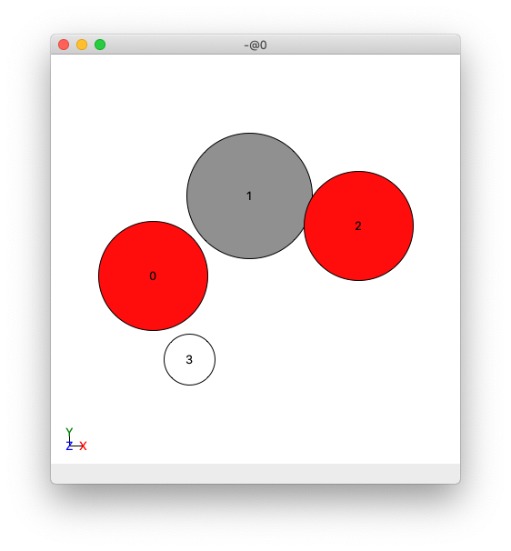

.. _Prelude_Info_for_Adsorbate_script:

Prelude 2: How to obtain some of the settings for the ``adsorber.py`` script
############################################################################

Following the :ref:`Prelude_General_and_Adsorbates_scripts` page that indicated what settings and inputs are needed to run the ``Adsorber`` program, on this webpage we will describe how to obtain some of the settings that are not obvious as to how to obtain them from the :ref:`Prelude_General_and_Adsorbates_scripts` page. This includes how to obtain the information required to tell Adsorber how to bind atoms and molecules to the surface of your system. 

This page requires the use of ASE GUI to view our chemical systems. The installation and use of this visualisation programs is given in :ref:`External_programs_that_will_be_useful_to_install_for_using_Adsorber`. 

.. _bind_molecule_to_surface_of_system:

How to Bind Molecule to the Surface of your Cluster/Surface Model in Adsorber
*****************************************************************************

There are many ways that a molecule can be bound to the surface of a cluster/surface model. There are two or three components that are important for adsorbing a molecule to a surface. These are the atom in the molecule that is bound to the surface *via* (**index**), the alignment of the molecule to the surface (**axis**), and the orientation of the molecule to the surface (**rotations**). These are given by the following three entries in the ``adsorbed_species`` dictionary for each molecule. 

* **index** (*int.*): This is the index of the atom in the molecule to adsorb to the surface for the cluster/surface model. 
* **axis** (*str./list/tuple*): This is the axis in your molecule that you would like to point away from the surface of the cluster/surface model, as well as to rotate your moleule around (if you would like to rotate your molecule around the axis). 
* **rotations** (*list/tuple*, optional): These are the angles of rotation that you would like to rotate the molecules around the **axis** on the surface of your cluster/surface model. If you have a linear molecule that is alligned to the **axis** or you do not want to rotate your molecule around the **axis**, you do not need to add this as this is an optional input. 

We will now describe the way to determine the **index**, **axis**, and **rotations** variables.

Specifying the **index** variable
=================================

First, open up the molecule that you want to adsorb to the surface in ASE. You can do this using the ASE GUI. If you are making your molecules in your ``Run_Adsorber.py`` you can take a look at it using the ``view`` method in the ``ase.visualize`` module:

.. code-block:: python
	
	from ase.visualize import view
	from ase.build import molecule

	COOH = molecule('HCOOH') # note the carbon is index 1
	del COOH[4] # remove the hydrogen atom

	view(COOH)

This will open a ASE GUI of the COOH molecule. If you click in the main menu ``View > Show Labels > Atom Index``, you will get the following view:

   View of a COOH molecule in ASE GUI, where the atoms have been labelled by their index. 

We would like to adsorb the C atom in the COOH molecule to the surface of our cluster/surface model. In this case, we would like to set **index** for this molecule to ``1`` to specify index 1.

Specifying the **axis** variable
================================

Next, we would like to specify the direction of the axis we would like to align our molecule to the surface of your cluster/surface model. 

This will align this axis to the "normal" of the surface. For above atom and bridge site, this axis will point as far away from any other atom on the cluster/surface model as possible. For this reason, we will point this vector from the **index** atom, which in this example is the index 1 C atom in this COOH molecule. 

For this example, we would like to align the molecule on the surface such that the oxygen atoms are on opposite sides of the **axis** vector as possible. This can be achieved with a vector that points ``(0.1,-1,0)`` from looking at the above figure of the COOH atom. 

Note that you can also specify the following string for the **axis** vector:

* ``'x'``:  This is the ``(1,0,0)`` vector
* ``'y'``:  This is the ``(0,1,0)`` vector
* ``'z'``:  This is the ``(0,0,1)`` vector
* ``'-x'``: This is the ``(-1,0,0)`` vector
* ``'-y'``: This is the ``(0,-1,0)`` vector
* ``'-z'``: This is the ``(0,0,-1)`` vector

The ``Adsorber`` program will use the `Rodrigues formula <https://en.wikipedia.org/wiki/Rodrigues%27_formula>`_ to rotate the molecule by this axis onto the "normal" vector of the surface. 

Specifying the **rotations** variable
=====================================

Often you will want to sample a specific orientation for the molecule to adsorb to the surface of the cluster/surface model. ``Adsorber`` allows you to rotate the ad-molecule about the **axis** vector on the surface of your cluster/surface model to try to get the orientation(s) that you like. 

``Adsorber`` has various options for how to rotate your adsorbate about each binding site on your system. You can choose to allow ``Adsorber`` to automatically choose how to rotate the adsorbate about each binding site. To choose this, set `rotation = 'automatic'`:

.. code-block:: python

   Adsorbed_Species['rotations'] = 'automatic'

``Adsorber`` will rotate the adsorbate so that each atom in the adsorbate is alligned to each nearby surface atom in the system, as well as alligned between those nearby surface atoms. However, some of the rotations may allign the adsorbate onto a local maximum that VASP does not optimise out of during a VASP local optimisation. For this reason, you can also specify ``Adsorber`` to slightly misalign each rotation by ± XX degrees: 

.. code-block:: python

   Adsorbed_Species['rotations'] = 'automatic with misalignment of XX degrees'

where XX is the rotation in degrees to misalign the adsorbates rotation by. For example, if you want to misalign an adsorbate by 10 degrees: 

.. code-block:: python

   Adsorbed_Species['rotations'] = 'automatic with misalignment of 10 degrees'

You can also choose custom rotations to rotate your adsorbate by. You can choose this option by specifying the angles you would like to rotate your adsorbate by in a list. For example: 

.. code-block:: python

   Adsorbed_Species['rotations'] = range(0,360,10)

If you choose custom rotations, it is recommended to try a wide range of rotations and delete those rotations that do not work for you. To do this, set rotation to a range of angles, such as ``range(0,360,10)``, where the angles are given in degrees. This will create 36 ``.xyz`` files of the same molecule adsorbed to the same site on the cluster/surface feature, where each image is a different rotated orientation of the molecule on the surface of your cluster/surface feature. 

The youtube clip below shows an example of all the orientations that are created by the ``Adsorber`` program for a COOH molecule adsorbed to a vertex site on a Cu78 nanocluster made by ``Adsorber`` (where ``Adsorbed_Species['rotations'] = range(0,360,10)``). 

.. raw:: html

    

      <iframe id="ytplayer" type="text/html" src="https://www.youtube.com/embed/fRnPBR23-_c?autoplay=1&loop=1&showinfo=0" frameborder="0" allowfullscreen style="position: absolute; top: 0; left: 0; width: 100%; height: 100%;"></iframe>
    

.. 

How to enter **index**, **axis**, and **rotations** into the ``adsorbed_species`` dictionary in the ``Run_Adsorber.py`` script
==============================================================================================================================

Once you have specied the **index**, **axis**, and **rotations**, you can add them to the ``adsorbed_species`` dictionary in the ``Run_Adsorber.py`` script. An example for a COOH molecule is shown below:

.. code-block:: python

	COOH = molecule('HCOOH') # note the carbon is index 1
	del COOH[4] # remove the hydrogen atom
	COOH_axis = (0.1,-1,0)
	distance_of_adatom_from_surface = 1.25
	rotations = range(0,360,10)
	COOH_adsorbed_species = {'name': 'COOH', 'molecule': COOH, 'distance_of_adatom_from_surface': distance_of_adatom_from_surface, 'index': 1, 'axis': COOH_axis, 'rotations': rotations}

This dictionary is then appended to the ``adsorbed_species`` list in the ``adsorbate.py`` script. See :ref:`Setting_your_adsorbatepy_scripts`.
