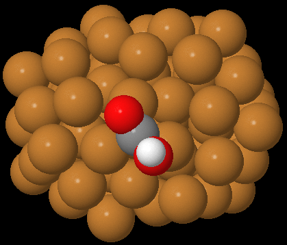
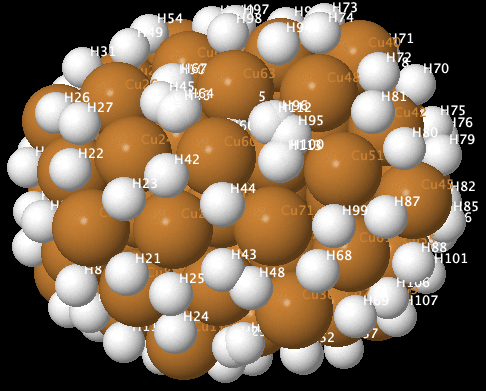

.. _What_to_do_with_the_Outputs_from_Adsorber:

What to do with all the output files from Running Adsorber the first time
#########################################################################

This page requires the use of Jmol to view our chemical systems. The installation and use of this visualisation programs is given in :ref:`External_programs_that_will_be_useful_to_install_for_using_Adsorber`. 

As mentioned in :ref:`Outputs_from_Adsorber`, ``Adsorber`` will now have given you up to four ``xyz`` files that contain all the binding sites that were found in your cluster/surface model. These are:

1. ``SYSTEM_NAME_above_atom_binding_sites.xyz``: Sites above individual surface atoms
2. ``SYSTEM_NAME_above_bridge_binding_sites.xyz``: Sites above bridging sites
3. ``SYSTEM_NAME_above_three_fold_sites.xyz``: Sites above three-fold sites
4. ``SYSTEM_NAME_above_four_fold_sites.xyz``: Sites above four-fold sites

You will have also been given a folder called ``System_with_Adsorbed_Species`` that contains many ``xyz`` files of your molecules that has been adsorbed on various binding sites of your cluster/surface model, in various orientations. 

The binding sites are labelled by the tag they are given in the binding site ``xyz`` files. You can easily view this by opening up the ``SYSTEM_NAME_above_atom_binding_sites.xyz``, ``SYSTEM_NAME_above_bridge_binding_sites.xyz``, ``SYSTEM_NAME_above_three_fold_sites.xyz``, or ``SYSTEM_NAME_above_four_fold_sites.xyz`` file in Jmol and clicking in the menu ``Display > Label > Name``. This will label all the atoms by their element symbol and number, where the binding site are labelled ``HX``, where ``X`` is the number of the hydrogen/binding site in the cluster/surface model. 

Each ``xyz`` file in ``System_with_Adsorbed_Species`` is labelled by the site given in ``SYSTEM_NAME_above_atom_binding_sites.xyz``:, ``SYSTEM_NAME_above_bridge_binding_sites.xyz``, ``SYSTEM_NAME_above_three_fold_sites.xyz``, and ``SYSTEM_NAME_above_four_fold_sites.xyz``. 

For example, if you want to see the COOH molecule bound to three-fold site 44, you would go to ``System_with_Adsorbed_Species > Above_Three_Fold_Sites > COOH`` and look at any of the file with ``site_44`` in its name. This example is shown below, next to the original three-fold binding site ``.xyz`` file. 

   This example cluster with a COOH molecule adsorbed to three-fold site 44 (just one of the orientations is shown in this example).

   Sites above three-fold sites (in between three neighbouring atoms), where three-fold binding site are labelled ``HX``, where ``X`` is the number for that binding site. 

Along with each site, you may have rotated the molecule about a binding site in various orientations.

The best way to use these ``xyz`` files is to delete all the orientations of the molecule on each binding site that you do not want to include in your study. You can also delete all the ``xyz`` files of binding sites that you do not want. You will find that there will be many binding sites in ``SYSTEM_NAME_above_atom_binding_sites.xyz``:, ``SYSTEM_NAME_above_bridge_binding_sites.xyz``, ``SYSTEM_NAME_above_three_fold_sites.xyz``, and ``SYSTEM_NAME_above_four_fold_sites.xyz`` that will not locally optimise properly, or are just silly. ``Adsorber`` is designed to find binding sites, but not all of them will be appropriate and some may be weird. For example, bridge sites and three-fold sites can be found around vacant five-fold sites, but these sites will likely be high energy sites. 

Once you have deleted all the ``xyz`` files of molecules adosrbed at various binding sites and of various orientation, you can then proceed to :ref:`How_to_use_output_data_to_obtain_VASP_data_of_systems_with_adsorbed_species` to prepare your ``Adsorber`` files for running in VASP *via* submitting to the Slurm Workload Manager. 