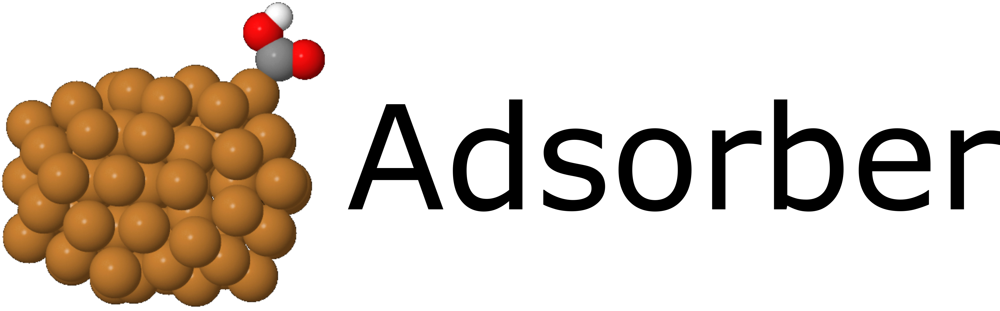

.. The Adsorber documentation master file, created by
   sphinx-quickstart on Mon Oct  1 08:10:30 2018.
   You can adapt this file completely to your liking, but it should at least
   contain the root `toctree` directive.

Welcome to the Adsorber documentation!
######################################

.. image:: https://img.shields.io/pypi/pyversions/Adsorber
   :target: https://docs.python.org/3/
   :alt: Python Version

.. image:: https://img.shields.io/github/v/release/GardenGroupUO/Adsorber
   :target: https://github.com/GardenGroupUO/Adsorber
   :alt: GitHub release (latest by date)

.. image:: https://img.shields.io/pypi/v/Adsorber
   :target: https://pypi.org/project/Adsorber/
   :alt: PyPI

.. image:: https://img.shields.io/conda/v/gardengroupuo/Adsorber
   :target: https://anaconda.org/GardenGroupUO/Adsorber
   :alt: Conda

.. image:: https://img.shields.io/github/license/GardenGroupUO/Adsorber
   :target: https://www.gnu.org/licenses/agpl-3.0.en.html
   :alt: Licence

.. image:: https://img.shields.io/lgtm/grade/python/github/GardenGroupUO/Adsorber
   :target: https://lgtm.com/projects/g/GardenGroupUO/Adsorber/context:python
   :alt: LGTM Grade

.. sectionauthor:: Geoffrey Weal <geoffrey.weal@gmail.com>
.. sectionauthor:: Dr. Anna Garden <anna.garden@otago.ac.nz>

Group page: https://blogs.otago.ac.nz/annagarden/

What is Adsorber
================

Adsorber is a program designed to adsorb molecules in various way to the surface of a cluster or a surface. This program adsorbed molecules ontop of atoms, ontop of bridge sites, ontop of three-fold sites, and ontop of four fold sites. 

A guide on how to use the ``Adsorber`` program is given in :ref:`Guide_To_Using_Adsorber`. 

Installation
============

It is recommended to read the installation page before using the Adsorber program. See :ref:`Installation: Setting Up Adsorber and Pre-Requisites Packages <Installation>` for more information. Note that you can install Adsorber through ``pip3`` and ``conda``. 

As well as installing Adsorber, the Atomic Simulation Environment (ASE) GUI and Jmol programs are also used to visualise your system with adsorbed atoms and molecules upon it. Installation and how to use the ASE GUI and Jmol can be found in :ref:`External_programs_that_will_be_useful_to_install_for_using_Adsorber`.

Guide To Using Adsorber
=======================

After you have installed Adsorber and all other helpful programs, see :ref:`Guide_To_Using_Adsorber` to learn about the process of using Adsorber to obtain models of your system with various adsorbates for further optimisation with VASP. 

Table of Contents
=================

.. toctree::
   :maxdepth: 2
   
   Installation
   External_programs_that_will_be_useful_to_install_for_using_Adsorber
   Guide_To_Using_Adsorber
   Prelude_1_How_To_Run_Adsorber
   Prelude_2_How_To_Obtain_Settings_for_Run_Adsorber
   Part_A_Optimising_System_Initially
   Part_B_Adsorb_Adsorbates_to_System
   Part_C_Preparing_Adsorbed_Systems_For_VASP
   Part_D_gathering_information_from_VASP_calculations
   genindex
   py-modindex

Indices and tables
==================

* :ref:`genindex`
* :ref:`modindex`